# Kiến Trúc Hệ Thống Invostream

Tài liệu này mô tả chi tiết kiến trúc kỹ thuật của Invostream — từ luồng xử lý dữ liệu, các thành phần hệ thống, cho đến cách chúng giao tiếp với nhau.

---

## Tổng Quan Kiến Trúc

Invostream được thiết kế theo mô hình **event-driven microservices**, chia thành 3 lớp chính:

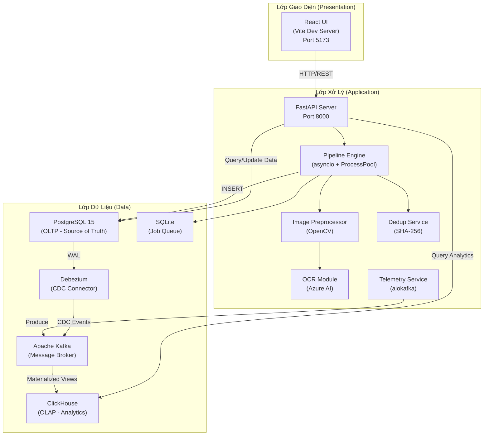

---

## Chi Tiết Từng Lớp

### 1. Lớp Giao Diện (Frontend)

**Công nghệ:** React 18, Vite 5, React Router DOM v6, Recharts, Lucide React

Frontend là một Single Page Application (SPA) giao tiếp với backend thông qua REST API.

#### Các trang chính:

| Route | Component | Chức năng | Data source |
|---|---|---|---|
| `/` | `Dashboard.jsx` | Analytics dashboard với biểu đồ real-time | ClickHouse (via API) |
| `/review` | `ReviewInvoices.jsx` | Danh sách hóa đơn, lọc theo status | PostgreSQL (via API) |
| `/review/:id` | `InvoiceDetail.jsx` | Chi tiết hóa đơn, form chỉnh sửa | PostgreSQL (via API) |
| `/upload` | `Upload.jsx` | Upload hóa đơn hàng loạt | FastAPI upload endpoint |

#### Luồng dữ liệu UI:

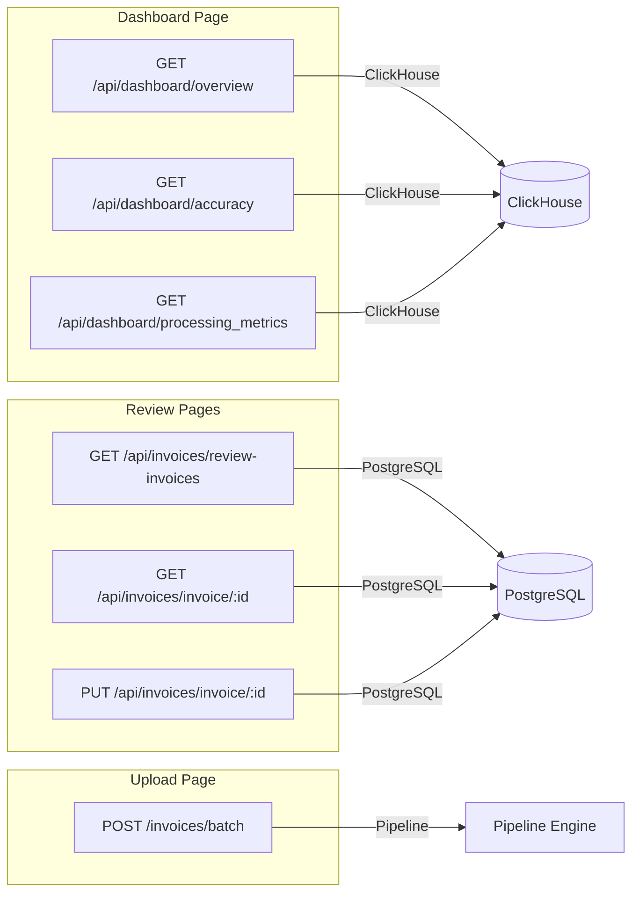

---

### 2. Lớp Xử Lý (Backend)

#### 2.1 FastAPI Server (`api/main.py`)

Server chính, chịu trách nhiệm:
- **Lifespan management:** Khởi tạo connection pool PostgreSQL khi start, đóng khi shutdown.
- **Background worker:** Khởi tạo `main_process()` loop lắng nghe job queue ngay khi server start.
- **CORS:** Cho phép frontend (`localhost:5173`) giao tiếp.
- **Static files:** Mount thư mục `data/raw/` để serve file gốc.

```python
# Lifecycle
@asynccontextmanager
async def lifespan(app: FastAPI):
    await init_db_pool()           # Khởi tạo asyncpg pool
    asyncio.create_task(main_process())  # Bắt đầu lắng nghe job queue
    yield
    await close_db_pool()          # Đóng pool khi shutdown
```

#### 2.2 Pipeline Engine (`pipeline/`)

Đây là phần lõi xử lý, chia thành 3 module:

##### `pipeline_ingest.py` — Ingestion Layer
- Nhận danh sách `UploadFile` từ API.
- Chia thành chunks (mỗi chunk 20 files) để xử lý song song.
- Gọi `batch_setup()` cho từng chunk.

##### `batch.py` — Batch Processing & Job Queue
- **Deduplication:** Tính SHA-256 hash cho mỗi file → kiểm tra database → loại bỏ trùng lặp.
- **Dedup trong cùng batch:** Sử dụng `seen_in_batch: set[str]` để tránh trùng lặp nội bộ.
- **Lưu file:** Ghi file gốc vào `data/raw/{batch_id}/`.
- **Enqueue:** Đẩy job vào `JOB_QUEUE` (asyncio.Queue).
- **Main Process Loop:** Vòng lặp vô hạn `while True`, lấy job → dispatch sang `ProcessPoolExecutor` → handle kết quả bất đồng bộ.

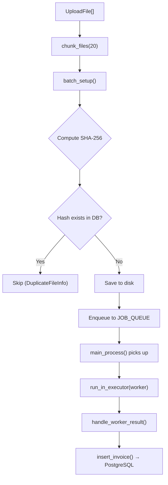

##### `runner.py` — Worker Process
- Chạy trong **child process** riêng biệt (qua `ProcessPoolExecutor`).
- Gọi `ingest_image()` → `extract_invoices()`.
- Trả kết quả dưới dạng `list[dict]` (serialize qua Pydantic `model_dump()`).

**Tại sao dùng `run_in_executor` thay vì `executor.submit`?**

`executor.submit()` sẽ block thread hiện tại của main process, khiến nó không thể lắng nghe batch tiếp theo. `loop.run_in_executor()` wrap submission thành Future trong async event loop, cho phép main process tiếp tục lắng nghe.

#### 2.3 Image Preprocessing (`image_process/`)

Pipeline xử lý ảnh tuần tự gồm 5 bước:

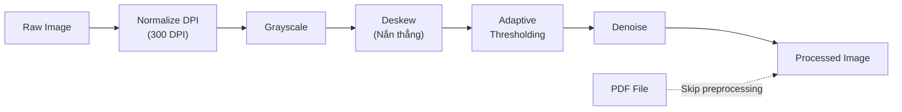

> **Lưu ý:** File PDF được bỏ qua toàn bộ pipeline image processing vì Azure Document Intelligence xử lý PDF gốc tốt hơn ảnh đã qua xử lý.

#### 2.4 OCR Extraction (`ocr/extraction.py`)

- Sử dụng **Azure AI Document Intelligence** với model `prebuilt-invoice`.
- Client async (`DocumentIntelligenceClient.aio`) — tất cả file trong batch được gửi **đồng thời** qua `asyncio.gather()`.
- Kết quả Azure trả về được map từ field name Azure → field name Pydantic model thông qua `FIELD_MAP`.
- **Line items** được xử lý riêng (`_extract_line_items()`) vì chúng là mảng lồng nhau.
- **Confidence scoring:** Nếu bất kỳ field nào có confidence < 0.8 hoặc value là None → status = `"review"`.
- Nếu extraction thất bại → trả về Invoice object với status = `"failed"` (không crash pipeline).

#### 2.5 Deduplication Service (`services/dedup/`)

Hệ thống chống trùng lặp 2 lớp:

| Lớp | Thời điểm | Cơ chế |
|---|---|---|
| **Lớp 1: Pre-OCR** | Trước khi enqueue job | `compute_hash()` → `find_existing()` kiểm tra trong PostgreSQL |
| **Lớp 2: DB-level** | Khi INSERT | `ON CONFLICT (content_hash) DO NOTHING` trong SQL |

```
File bytes → SHA-256 hash → Check DB → [Exists? Skip] → [New? Process & Insert]
                                         ↓ (safety net)
                                    INSERT ... ON CONFLICT DO NOTHING
```

#### 2.6 Telemetry Service (`services/telemetry/`)

Hệ thống đo lường hiệu năng non-blocking:

##### `tracer.py` — Instrumentation

Cung cấp 2 cơ chế đo lường:

1. **`@track_time(step_name)` decorator** — Wrap toàn bộ function:
   ```python
   @track_time("upload")
   async def ingest(folder: list[UploadFile]):
       ...
   ```

2. **`track_block(step_name, batch_id)` context manager** — Wrap một đoạn code cụ thể:
   ```python
   with track_block("ocr", batch_id):
       poller = await client.begin_analyze_document(...)
   ```

##### `exporter.py` — Kafka Producer

- Sử dụng **aiokafka** (async producer) để đẩy metric vào Kafka topic `invostream.telemetry`.
- **Non-blocking:** Sử dụng `asyncio.create_task()` để export metric mà không block pipeline chính.
- **Producer pool:** Cache producer theo event loop ID để tránh tạo lại connection.

---

### 3. Lớp Dữ Liệu (Data Layer)

#### 3.1 PostgreSQL — Source of Truth (OLTP)

**Image:** `debezium/postgres:15` (có WAL replication plugin `pgoutput` built-in)

##### Schema:

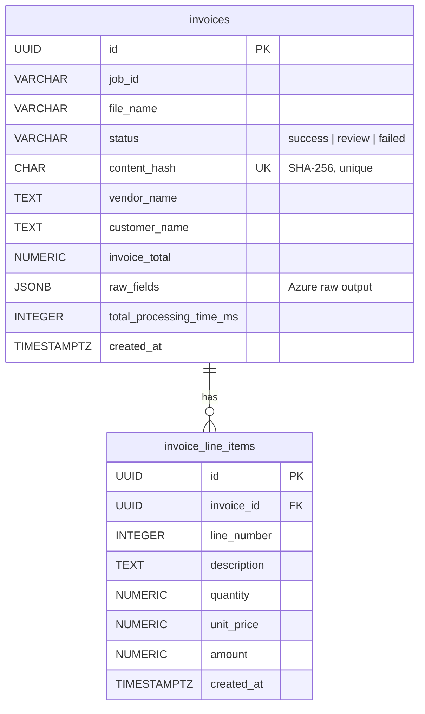

##### Connection Pool:

- **Library:** asyncpg (pure Python, async PostgreSQL driver)
- **Pool size:** min=1, max=10 connections
- **Pattern:** `async with get_db_connection() as conn`
- **Transactions:** `async with connection.transaction()` đảm bảo invoice + line items insert atomically.

#### 3.2 ClickHouse — Analytics Engine (OLAP)

**Schema:** Star Schema (Kimball-style)

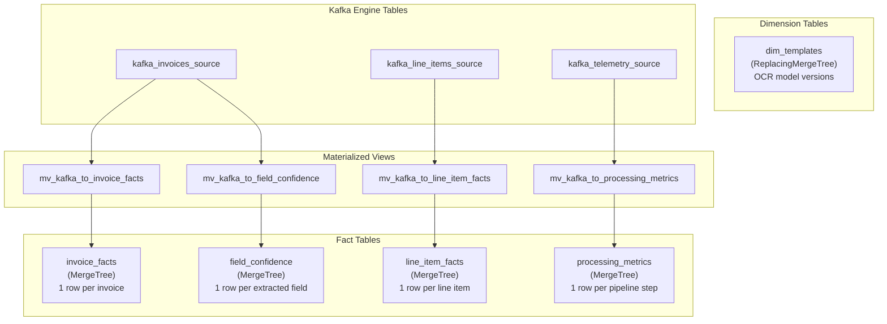

##### Tại sao Star Schema?

Dashboard queries luôn theo pattern: `GROUP BY time, template, vendor → SUM/AVG/COUNT`. Star Schema cho phép ClickHouse chỉ scan các column cần thiết — đúng thế mạnh của columnar storage.

##### Partitioning:

Tất cả fact tables được partition theo `toYYYYMM(created_at)`, giúp:
- Xóa dữ liệu cũ dễ dàng (drop partition).
- Query gần đây nhanh hơn (chỉ scan partition hiện tại).

#### 3.3 Apache Kafka — Message Broker

**Topics:**

| Topic | Producer | Consumer | Nội dung |
|---|---|---|---|
| `invostream.public.invoices` | Debezium | ClickHouse (Kafka Engine) | CDC events khi INSERT/UPDATE invoices |
| `invostream.public.invoice_line_items` | Debezium | ClickHouse (Kafka Engine) | CDC events khi INSERT/UPDATE line items |
| `invostream.telemetry` | aiokafka (Python) | ClickHouse (Kafka Engine) | Step-level latency metrics |

#### 3.4 Debezium — Change Data Capture

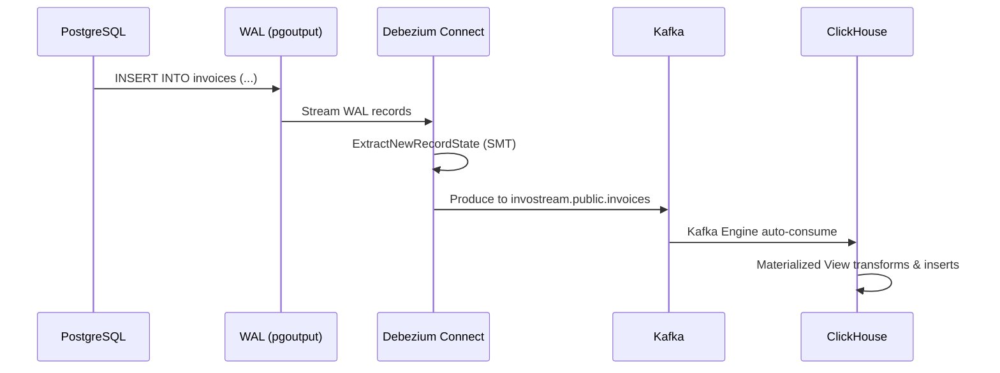

##### Cấu hình quan trọng:

| Config | Giá trị | Giải thích |
|---|---|---|
| `plugin.name` | `pgoutput` | PostgreSQL native replication protocol |
| `table.include.list` | `public.invoices, public.invoice_line_items` | Chỉ capture 2 bảng này |
| `transforms.unwrap.type` | `ExtractNewRecordState` | Unwrap envelope, chỉ lấy `after` state |
| `decimal.handling.mode` | `double` | Convert NUMERIC → Float64 cho ClickHouse |
| `key/value.converter` | `JsonConverter` | JSON format cho Kafka messages |

#### 3.5 SQLite — Job Queue

Lưu trữ trạng thái job queue (batch tracking, file paths) cục bộ. Nhẹ, không cần server riêng.

---

## Luồng Xử Lý End-to-End

### Luồng 1: Upload & OCR Processing

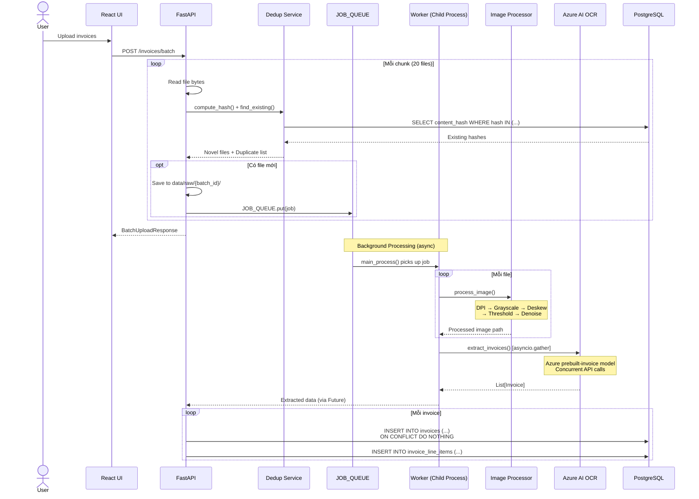

### Luồng 2: CDC → Analytics Pipeline

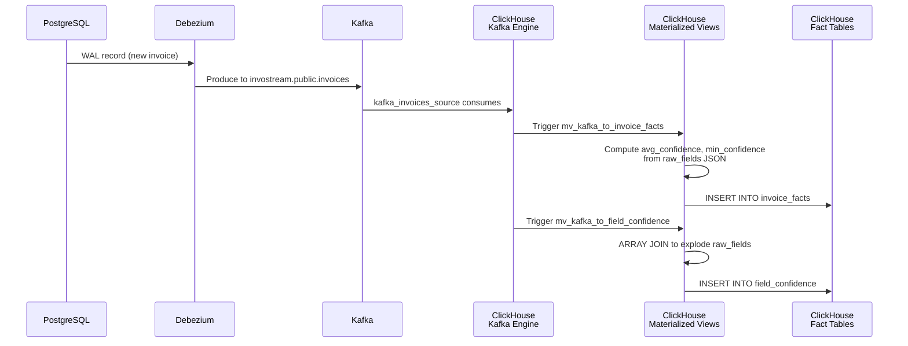

### Luồng 3: Telemetry Pipeline

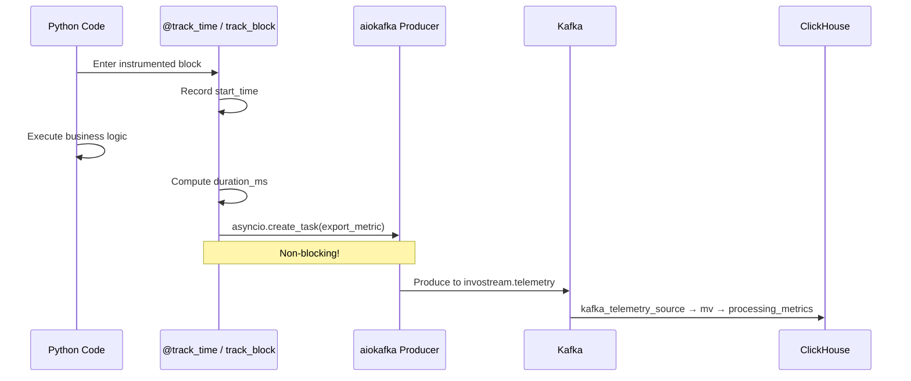

### Luồng 4: Human-in-the-Loop Review

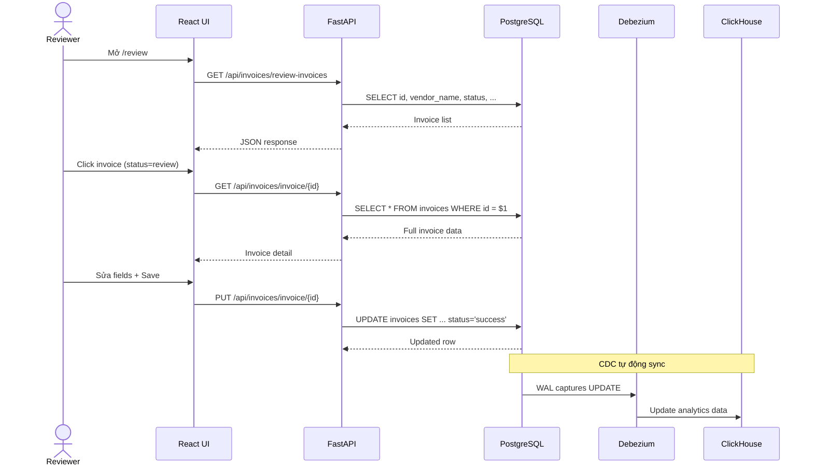

---

## Các Quyết Định Thiết Kế Quan Trọng

### 1. CDC thay vì Dual-Write

**Ban đầu:** Hệ thống dùng dual-write — sau khi INSERT vào PostgreSQL, gọi thêm `insert_analytics()` để write trực tiếp vào ClickHouse.

**Hiện tại:** Chuyển sang CDC (Debezium → Kafka → ClickHouse native consume). Lý do:
- **Consistency:** Không bao giờ mất dữ liệu — nếu ClickHouse down, Kafka giữ message cho đến khi ClickHouse recover.
- **Đơn giản hóa code:** Chỉ cần write 1 lần vào PostgreSQL, phần còn lại tự động.
- **Decoupling:** PostgreSQL không cần biết ClickHouse tồn tại.

### 2. asyncio.Queue + ProcessPoolExecutor

**Vấn đề:** OCR là CPU-intensive + I/O-intensive, nếu chạy trên main thread sẽ block toàn bộ API.

**Giải pháp:**
- `asyncio.Queue` để decouple upload request khỏi processing.
- `ProcessPoolExecutor` để spawn child processes cho OCR (tận dụng multi-core CPU).
- `asyncio.create_task(handle_worker_result(...))` để handle kết quả mà không block main loop.

### 3. Materialized Views cho Realtime Analytics

ClickHouse Kafka Engine + Materialized Views cho phép:
- **Zero-latency ingestion:** Data từ Kafka được insert vào fact tables ngay khi arrive.
- **Transform on-the-fly:** Materialized Views tính `avg_confidence`, `min_confidence` từ `raw_fields` JSON ngay trong quá trình ingest.
- **No consumer code needed:** Không cần viết consumer bằng Python — ClickHouse tự consume natively.

### 4. Confidence-based Review System

Thay vì tất cả hóa đơn đều cần review, hệ thống tự phân loại:
- `status = "success"` → Tất cả fields có confidence ≥ 0.8 → Tự động approve.
- `status = "review"` → Có field confidence < 0.8 hoặc value = None → Cần human review.
- `status = "failed"` → OCR extraction thất bại hoàn toàn.

---

## Monitoring & Observability

| Công cụ | URL | Chức năng |
|---|---|---|
| **Kafdrop** | `http://localhost:9090` | Xem Kafka topics, messages, consumer groups |
| **ClickHouse Play** | `http://localhost:8123/play` | Chạy SQL queries trực tiếp trên ClickHouse |
| **Debezium REST** | `http://localhost:8083/connectors` | Kiểm tra trạng thái CDC connectors |
| **FastAPI Docs** | `http://localhost:8000/docs` | Swagger UI cho tất cả API endpoints |
| **Console Logs** | `docker logs invostream-api` | Server logs, pipeline progress, telemetry |

---

## Hạn Chế Hiện Tại & Hướng Phát Triển

### Hạn chế
- **Chưa có authentication/authorization** — API và UI đều public.
- **Chưa có retry mechanism** — Nếu Azure OCR timeout, file bị mark `failed` và không tự retry.
- **Telemetry thiếu correlation** — Các metric chưa được liên kết theo `batch_id` hoặc `invoice_id` trong processing_metrics.
- **Frontend chưa auto-refresh** — Dashboard cần refresh thủ công để thấy data mới (chưa có WebSocket/SSE).
- **Chưa có migration tooling** — Schema changes phải chạy SQL thủ công.

### Hướng phát triển
- **WebSocket real-time updates** cho dashboard và upload progress.
- **Retry queue** với exponential backoff cho failed OCR jobs.
- **Custom OCR model training** — hỗ trợ fine-tune model cho từng loại hóa đơn.
- **Grafana integration** cho monitoring toàn diện (đã có config sẵn trong docker-compose, chưa bật).
- **CI/CD pipeline** với automated testing.
- **Rate limiting & API key authentication**.
