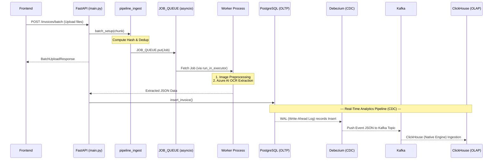

# Invostream

**Invostream** is a high-performance, event-driven data pipeline designed for real-time invoice processing, OCR extraction, and analytics. It seamlessly integrates a robust backend orchestrating Azure's Document Intelligence with a modern React frontend and an advanced Change Data Capture (CDC) streaming infrastructure.

## Key Features

- **Asynchronous & Multiprocessing OCR:** Scalable invoice ingestion utilizing Python `ProcessPoolExecutor` and background workers to process heavy OCR jobs without blocking the main API thread.
- **Smart Deduplication:** File-hash checks intercept duplicate invoices prior to any expensive database or OCR operation, minimizing cloud API costs.
- **Real-Time Data Streaming:** Features a robust CDC pipeline via **Debezium & Kafka**, automatically capturing row-level data changes from PostgreSQL.
- **High-Speed Analytics:** Leverages **ClickHouse** as the OLAP database natively consuming from Kafka, empowering blazingly fast dashboard metrics.
- **Modern UI:** Built with React, Vite, and Recharts, offering an elegant "human-in-the-loop" UI for telemetry tracking, invoice review, and analytics.

## Technology Stack
### Backend
- **Framework:** FastAPI, Uvicorn
- **AI / OCR:** Azure AI Document Intelligence, OpenCV, Scikit-image, pdf2image
- **Database (OLTP):** PostgreSQL (SQLAlchemy, asyncpg, psycopg2-binary)
- **Task Orchestration:** `asyncio` Queue & Python ProcessPoolExecutor

### Data Infrastructure (CDC Pipeline)
- **Message Broker:** Apache Kafka & Zookeeper
- **Change Data Capture:** Debezium
- **Analytics (OLAP):** ClickHouse
- **Monitoring:** Kafdrop

### Frontend
- **Framework:** React 18 (Vite)
- **Routing:** React Router DOM
- **Data Visualization & UI:** Recharts, Lucide React

## System Architecture
Below is the execution flow of the system. Invoices are ingested, deduplicated, and passed to worker nodes. The extracted metadata is inserted into PostgreSQL, which instantly triggers a Debezium event to Kafka, finally landing in ClickHouse for real-time visualization.

